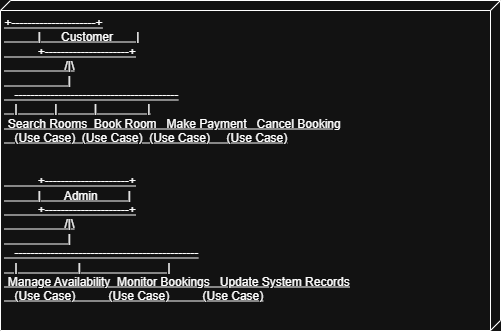

# requirement-analysis

# Requirement Analysis in Software Development

This repository contains the documentation and analysis for a Booking Management System as part of the Requirement Analysis Project.  
It demonstrates the process of gathering, analyzing, and structuring requirements in the Software Development Lifecycle (SDLC).

---

## What is Requirement Analysis?

Requirement Analysis is the process of identifying, gathering, documenting, and validating the needs of stakeholders to ensure the development of a system that meets business and user goals.  
It plays a critical role in the SDLC because it sets the foundation for design, implementation, and testing.

---

## Why is Requirement Analysis Important?

1. **Clarity & Understanding** – Helps developers and stakeholders share a common understanding.  
2. **Error Reduction** – Identifies and fixes issues early, reducing cost and time.  
3. **Scope Management** – Prevents scope creep by clearly defining what is and isn’t part of the system.  

---

## Key Activities in Requirement Analysis

- **Requirement Gathering** – Collecting initial inputs from stakeholders.  
- **Requirement Elicitation** – Using interviews, surveys, and workshops to refine requirements.  
- **Requirement Documentation** – Structuring and recording requirements in detail.  
- **Requirement Analysis & Modeling** – Creating diagrams, models, and structured descriptions.  
- **Requirement Validation** – Ensuring the documented requirements meet business goals.  

---

## Types of Requirements

### Functional Requirements
These describe what the system should do.  
For the booking system:  
- Users can search available rooms.  
- Customers can book a room.  
- System allows payments.  
- Users can cancel bookings.  

### Non-Functional Requirements
These describe system qualities (how it works).  
For the booking system:  
- The system should handle up to 10,000 concurrent users.  
- Booking confirmation must be completed within 2 seconds.  
- The system should be available 99.9% of the time.  
- Payments must be processed securely using encryption.  

---

## Use Case Diagrams

Use case diagrams show the interactions between actors and the system.  
They help stakeholders visualize how users interact with the booking management system.

---

## Acceptance Criteria

Acceptance criteria define the conditions that a feature must satisfy to be accepted by stakeholders.  

**Example – Checkout Feature**:  
- User can select a room and proceed to checkout.  
- Payment gateway processes valid payments successfully.  
- System displays a confirmation message after payment.  
- Booking details are stored and retrievable by the user.  

---

---

## 📌 Conclusion
This repository demonstrates the importance of Requirement Analysis in ensuring successful software projects. 
By clearly defining requirements, modeling system interactions, and setting acceptance criteria, we lay a strong foundation for the **Booking Management System** and future scalable solutions.
